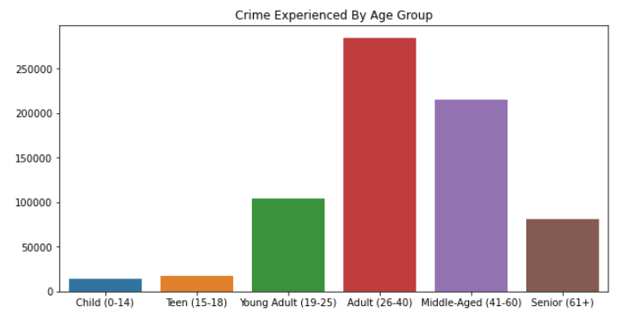
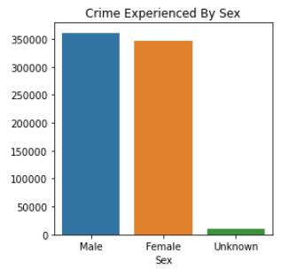
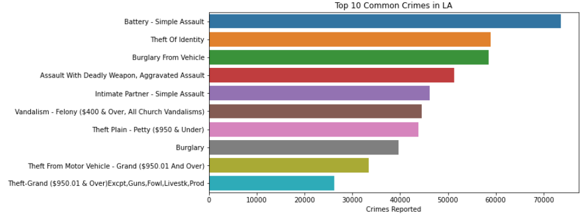
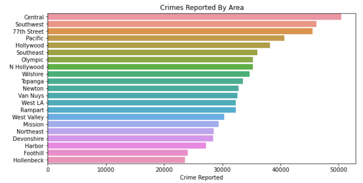
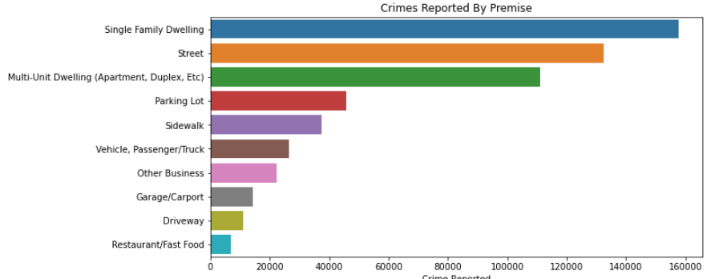

# Los Angeles Crime
## Source Data
https://catalog.data.gov/dataset/crime-data-from-2020-to-present

## Purpose
To generate a report giving readers a better understanding of crime in LA

## Tools
- Python (pandas, matplotlib, seaborn)
- Jupyter Notebook

## Findings:

1. Crime Victims By Age Group:
  - Adult (26-40) - 40%
  - Middle Aged (41-60) - 30%
  - Young Adult (19-25) - 15%
  - Senior (61+) - 11%
  - Teen (15-18) - 2%
  - Child (0-14) - 2%

Individuals between 26 to 60 years old are victims of the majority of crimes with approximately 500,000 reported crimes accounting for 70% of total crimes reported in LA

2. Crime Victims By Race:
  - Hispanic/Latin - 40%
  - White - 25%
  - Black - 18%
  - Other - 9%
  - Asian - 5%

Approximately 285,000 crimes reported have Hispanic/Latin as victims, 180,000 crimes reported have Whites as victims, 131,000 have Blacks as victims, and 37,000 have Asians as victims

*The Unknown bar in the plot below represents the race of the victim to which the crime has been reported is unknown*

3. Crimes Victims By Sex:
 - Male - 50%
 - Female - 48%
 - Unknown - 1%

*The Unknown sex represents the sex of the victim to which the crime has been reported is unknown*

 

 4. 5 Most Reported Crimes in LA:
 - Battery - Simple Assault - 10.28%
 - Theft of Identity - 8.21%
 - Burglary From Vehicle - 8.17%
 - Assault With Deadly Weapon, Aggravated Assault - 7.16%
 - Intimate Partner - Simple Assault - 6.45%

The most reported crime in LA is Battery - Simple Assault with over 70,000 occurances while only accounting for 10.28% of total crime in LA

5. Crimes Reported By Area:
- Central - 7.03%
- Southwest - 6.43%
- 77th Street - 6.34%
- Pacific - 5.67%
- Hollywood - 5.32%

6. Crimes Reported By Premise:
- Single Family Dwelling - 22.00%
- Street - 18.47%
- Multi-Unit Dwelling (Apartment, Duplex, Etc) - 15.51%
- Parking Lot - 6.37%
- Sidewalk - 5.24%

Homes are a likely place for crimes to occur with almost a quarter of the crimes reported taking place in a Single Family Dwelling with over 157,000 incidents. Over 111,000 crimes reported have occurred in a Mult-Unit Dwelling. Homes account for 37.51% of premises for which crimes have been reported

- More than 50% of victims are aged 25 and over
- 1 in 3 people aged 35-49 are victims of a a crime or 30.31%, followed by people aged 25-34 at 28.10%, and 50-64 at 18.47%
- 1 in 10 people aged 20-24 are vicitms of a crime or 9.86%
- 40% of victims are hispanic, 25% are white and 18% are black, followed by asians and others
- 51% of victims are male
- Males 35+ experience more crime than females, whereas females 34 and under experience more crime than males

- The most common crimes in LA are assault, theft, burglary, and vandalism
- The percentages of the top 5 most common crimes are as follows:
  - Battery - Simple Assault - (Accounts for 10.28% of crime in LA)
  - Theft of Identity - 8.22%
  - Burglary from Vehicle - 8.17%
  - Assualt with Deadly Weapon, Aggravated Assault - 7.15%
  - Intimate Partner - Simple Assault - 6.45%

 
- 38.38% of assault crimes are BATTERY - SIMPLE ASSAULT, where victims are mostly black (22.20%) and hispanic (56.86%)
- 25.57% are ASSAULT WITH DEADLY WEAPON, AGGRAVATED ASSAULT, where victims are mostly black (29.68%) and hispanic (55.52%)
- 24.15% are INTIMATE PARTNER - SIMPLE ASSAULT, where victims are mostly black (26.45%) and hispanic (57.09%)
- Males are likely to be be victims in crimes involving ASSAULT WITH DEADLY WEAPON ON POLICE OFFICER or AGGRAVATED ASSAULT crimes at 93% and 72% respectively
- Males aged 35-49 have the highest rate of being victims in ASSAULT WITH DEADLY WEAPON, AGGRAVATED ASSUALT crimes, followed by males aged 25-34
- Females are likely to be victims in INTIMATE PARTNER - SIMPLE AND AGGRAVATED ASSAULT crimes at 78% and 76% respectively

- Females who are victims to intimate partner assaults are likely to be aged 25-34 (38.78%) or 35-49 (30.51%)

- 45% of females 45 and under are victims of rape, with 1 in 2 females being of hispanic descent (52.84%), and 1 in 5 females being white (19.45%) and black (21.07%)

- The majority of crimes have not led to arrests with 76.71% of reported crimes having ongoing investigations, with only approximately 9% of investigations leading to arrests
- 51% of crimes are reported on the day of occurrence, with 19% reported the next day, and 16% reported within 2-7 days
- The top 3 premises for crime in LA are:
  - Single Family Dwelling (22.25%)
  - Street (18.53%)
  - Multi-Unit Dwelling (Apartment, Duplex, etc) (15.65%)
- Top 3 LA Areas that experience the most crime are: Central, 77th Street, and Pacific and Southwest (tied)
