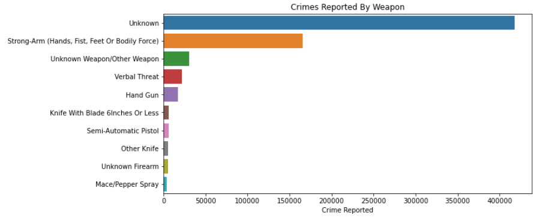

# Los Angeles Crime
## Source Data
https://catalog.data.gov/dataset/crime-data-from-2020-to-present

## Purpose
To generate a report giving readers a better understanding of crime in LA

## Tools
- Python (pandas, matplotlib, seaborn)
- Jupyter Notebook

## Findings:

1. Crime Victims By Age Group:
  - Adult (26-40) - 40%
  - Middle Aged (41-60) - 30%
  - Young Adult (19-25) - 15%
  - Senior (61+) - 11%
  - Teen (15-18) - 2%
  - Child (0-14) - 2%

Individuals between 26 to 60 years old are victims of the majority of crimes with approximately 500,000 reported crimes accounting for 70% of total crimes reported in LA.

2. Crime Victims By Race:
  - Hispanic/Latin - 40%
  - White - 25%
  - Black - 18%
  - Other - 9%
  - Asian - 5%

Approximately 285,000 crimes reported have Hispanic/Latin as victims, 180,000 crimes reported have Whites as victims, 131,000 have Blacks as victims, and 37,000 have Asians as victims.

*The Unknown bar represents the race of the victim to which the crime has been reported is unknown*

3. Crimes Victims By Sex:
 - Male - 50%
 - Female - 48%
 - Unknown - 1%

*The Unknown sex represents the sex of the victim to which the crime has been reported is unknown*

 

 4. 5 Most Reported Crimes in LA:
 - Battery - Simple Assault - 10.28%
 - Theft of Identity - 8.21%
 - Burglary From Vehicle - 8.17%
 - Assault With Deadly Weapon, Aggravated Assault - 7.16%
 - Intimate Partner - Simple Assault - 6.45%

The most reported crime in LA is Battery - Simple Assault with over 70,000 occurances while only accounting for 10.28% of total crime in LA.

5. Crimes Reported By Area:
- Central - 7.03%
- Southwest - 6.43%
- 77th Street - 6.34%
- Pacific - 5.67%
- Hollywood - 5.32%

6. Crimes Reported By Premise:
- Single Family Dwelling - 22.00%
- Street - 18.47%
- Multi-Unit Dwelling (Apartment, Duplex, Etc) - 15.51%
- Parking Lot - 6.37%
- Sidewalk - 5.24%

Homes are a likely place for crimes to occur with almost a quarter of the crimes reported taking place in a Single Family Dwelling with over 157,000 incidents. Over 111,000 crimes reported have occurred in a Mult-Unit Dwelling. Homes account for 37.51% of premises for which crimes have been reported.

7. Crimes Reported By Weapon Used:
- Strong-Arm (Hands, Fist, Feet Or Bodily Force) - 23.06%
- Unknown Weapon/Other Weapon - 4.31%
- Verbal Threat - 3.09%
- Hand Gun - 2.42%
- Knife With Blade 6 Inches or Less - 0.89%

*The Unknown bar indicates that it is unknown whether a weapon was used for the reported crime. It accounts for 58.24% of reported crimes.*

8. Crimes Reported By Status:
- Investigation Continued - 76.75%
- Adult Other - 13.63%
- Adult Arrest - 9.07%
- Juvenile Arrest - 0.34%
- Juvenile Other - 0.21%

9. Time It Takes To Report A Crime:
- Same Day - 51.20%
- Within 24 Hours - 18.82%
- 2-7 Days - 15.99%
- 60+ Days - 4.05%
- 29-60 Days - 2.59%

