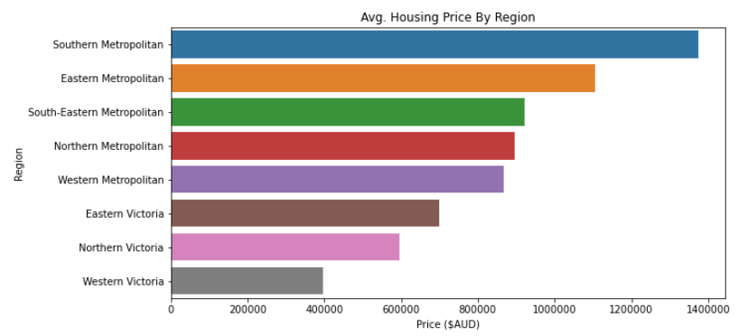

# Melbourne Housing Snapshot
## Source Data
https://www.kaggle.com/datasets/dansbecker/melbourne-housing-snapshot

## Purpose
Perform exploratory data analysis on the Melbourne Housing dataset and to see how expensive housing is.

## Tools
- Jupyter Notebook
- Python (pandas, seaborn, matplotlib)

## Findings:

1. The average price for a dwelling in Melbourne is \$1,075,488 (Australian Dollar)

2. Housing units can be classified into 3 categories: House (or cottage, villa, semi, terrace), Unit (or duplex), and Townhouse. The following table displays statistics for each dwelling:
| Dwelling Type | Avg. Price ($AUD) | Max. Price ($AUD) | Min. Price ($AUD) | Median Price ($AUD) |
|-|-|-|-|-|
| House | 1,242,409 | 9,000,000 | 131,000 | 1,080,000 |
| Townhouse | 933,930 | 3,475,000 | 300,000 | 846,000 |
| Unit | 605,288 | 3,625,000 | 85,000 | 560,000 |

3. The most expensive housing on average is located in the Southern Metropolitan region of Melbourne with an average housing price of \$1,374,652, while Western Victoria has the least expensive housing on average at \$397,523

4. 75\% of housing costs at least \$650,000

